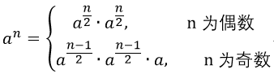
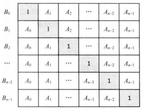

剑指offer精简总结
------
# 说明：
- 所用图书：剑指offer第二版
- 括号内是考察的知识点
- 题目前加 * 代表该题需要着重去理解（*的数目代表着重理解程度）
- 标红（下划线）的地方是需要着重理解
- 添加与LeetCode对应的题号（虽然目前LeetCode有剑指offer专题，但是题解较少）

# 3． 数组中的重复数字（数组）

## 3.1 判断重复数字（桶的思想）

长度为 n 的数组数字范围在0 —— n-1范围内，存在某些（不知道几个也不知道那些）数字重复，返回任意一个重复数字。

思路：0 — n-1是重点，可以让数字与下标各就各位（类似于桶），然后判断下标与数字是否相等，如果不相等，就与正确的位置进行交换（若原本正确位置的元素是正确的，说明这个数字重复了）。

## 3.2 *不修改数组找到任意重复数字（鸽巢原理，二分查找）

n+1 长度的数组在 1 —— n 范围内，一定存在重复数字（一个或多个），找出任意一个重复数字，不能修改数组！
思路：n个数存在n+1的长度内（鸽巢原理），不断的二分 数的范围，统计全部的元素数目与范围的关系，如果元素数目**大于** 数的范围 长度，说明这个里面肯定有重复

## 补充：缺失的第一个正数
LeetCode41题(hash章节)：给你一个未排序的整数数组，请你找出其中没有出现的最小的正整数。
思路：数组长度为N，那么缺失的最小正整数一定在 [1, N+1] 之间，使用 -1 标记，注意将< 0 和 >n 的数先替换成n+1.

# 4.二维数组中的查找（有序数组，搜索）

LeetCode240：二维数组中，每一行是有序的，每一列也是有序的，在此二维数组中查找是否存在某一整数target。
Log(m+n)思路：左下角或者右上角开始，双指针(row和col)曲折移动，缩小搜索面积
相关题目：LeetCode240（坐标转换）

# 5. 替换空格（字符串，双指针）

题目请实现一个函数，将一个字符串中的每个空格替换成“%20”。例如，当字符串为We Are Happy.则经过替换之后的字符串为We%20Are%20Happy。

不可以用从前往后替换的O(n2)算法（从前往后替换，在数组中需要逐步后移元素）

O(n)思路：预先遍历一遍字符串数组，统计好空格数目，预先分配空间，然后使用两个指针，P1指向字符串的尾部，P2指向最终字符串的尾部（已预先分配好空间）；然后P1从后往前扫描字符串：碰见不是空格的字符，就让字符串后移到P2，P2前移1个位置；碰见空格，在P2前插入“%20”，P2前移3个位置。

# 6. 从尾到头打印链表（链表，栈）

思路：后递归（系统栈）；使用栈

# 7. 重建二叉树（树，遍历）

从二叉树的前序遍历和中序遍历的结果重建二叉树。LeetCode105

考察：二叉树的遍历（三种遍历的特点都要烂熟于心），前中，后中有唯一的二叉树，前后序列重建的二叉树不唯一。

树的问题本质是一个分治（分解成左右子树），然后使用递归更简单

思路：根据二叉树前和中序序列，划分（使用数组的下标来标记start和end）左右子树，然后根据递归的构建左右子树。两种划分策略，可以使用全局变量计数，也可以使用统计预先设置右侧的前序位置。

# 8. 二叉树的下一个节点（树，遍历，迭代）

给定一个二叉树和其中的一个结点，请找出中序遍历顺序的下一个结点并且返回。注意，树中的结点不仅包含左右子结点，同时包含指向父结点的指针。

考察：对于二叉树中序遍历的深入理解，如果没有指向父节点的指针，那么可以直接使用一个TreeNode pre指针，当pre为target时候，cur就是下一个节点。

本题迭代思路：分情况讨论，当节点有右子树，下一个节点就是右子树中最左子节点；当没有右子树的时候：1. 它是父节点的左子节点，那么它的下一个节点就是它的父节点。2. 它是父节点的右子节点，沿着父节点指针一直向上遍历，直到找到是它父节点的左子节点的节点。

# 9. 用两个栈实现队列（数据结构，栈，队列）

用两个栈来实现一个队列，完成队列的Push和Pop操作。 队列中的元素为int类型。

思路：使用stack1进行push，使用stack2进行pop（当stack2为空的时候，就把stack1中所有的元素都pop进stack2）

相近题目：LeetCode225：使用一个队列模拟栈：push或者pop的时候，倒过来

# 10. 斐波那契数列（迭代写法，DP）

递归效率比较低，需要进行大量的重复运算，本题考查的是迭代写法。

思路：n < 2时候，`{0,1}，n >=2`时候，`a=0,b= 1`, 不断的去迭代a和b，` a, b = b, a+b`

这其实是状态压缩后的DP。

# 11. *旋转数组的最小数字（二分）

把一个数组最开始的若干个元素搬到数组的末尾，称为数组的旋转。求一个增序排序（数组中有可能含有重复）的数组的旋转数组的最小数字。LeetCode153, LeetCode154

**二分查找模板：**

```Java
int start = 0, end = length - 1; 
while(start < end) {
        mid = start + (end - start) / 2;
        if g(mid)  
            end = mid ;  // 左侧
        else
            start = mid + 1;  // 右侧
}
return start;  //  How to use upper bound (start) ?
```

O(LogN) 思路（既适用于无重复元素又适用于有重复元素的旋转数组）：
​	二分查找的g函数为：
​	nums[m] < nums[r]说明在左侧r=mid; 
​	nums[m] > nums[r]说明在右侧l=mid+1; 
​	nums[m] == nums[r]  r- -;

# 12. 矩阵中的路径（回溯）

请设计一个函数，用来判断在一个矩阵中**是否存在一条**包含某字符串所有字符的路径。路径可以从矩阵中的任意一个格子开始，每一步可以在矩阵中向左，向右，向上，向下移动一个格子。如果一条路径经过了矩阵中的某一个格子，则之后不能再次进入这个格子，LeetCode79。

典型的回溯，模板如下。
```Java
// 找到所有方案
void findSolutions(n, other params) {
    if (found a solution) {  // 找到一个答案
        // solutionsFound = solutionsFound + 1;
        addSolution();  // 将当前solution添加到solution list中
        // if (solutionsFound >= solutionTarget) : 
            // System.exit(0);
        return
    }
   // 有的写不成循环，要分多个情况进行讨论；本质上循环就是多个情况，只不过写起来比较简单而已
    for (val = first to last) {     // or start（开始位置参数） to last
        if (! isValid(val, n)) continue;  // 剪枝 
        applyValue(val, n);  // 改变参数
        findSolutions(n+1, other params);
        removeValue(val, n);  
// 一个方案是否存在
boolean findSolutions(n, other params) {
    if (found a solution) {
        displaySolution();
        return true;
    }
    for (val = first to last) {  // or start（开始位置参数） to last
        if ( !isValid(val, n)) continue;
        applyValue(val, n);
        if (findSolutions(n+1, other params)) return true;
        removeValue(val, n);
    }
   return false;
}
```

路径搜索：回溯法，递归三要素（结束条件、进入递归、返回值）。回溯的题目中，进入递归的时候，可以剪枝，但是别加上额外的判断了（为了避免多一次递归），多一次循环虽然多一点点开销，但是令程序不太清晰，所以在前面进行判断就行了，后面进入递归的时候就不要进行判断了。

路径条数：DP（LeetCode62，LeetCode63）

# 13. *机器人的运动范围（DFS）

地上有一个m行和n列的方格。一个机器人从坐标0,0的格子开始移动，每一次只能向左，右，上，下四个方向移动一格，但是不能进入行坐标和列坐标的数位之和大于k的格子。例如，当k为18时，机器人能够进入方格（35,37），因为3+5+3+7 = 18。但是，它不能进入方格（35,38），因为3+5+3+8 = 19。请问该机器人能够达到多少个格子？

思路：典型的DFS。添加一个visited数组记录是否被访问了，不用再将visited[i]重置为false（因为不是回溯）。dfs返回值是一个整数，代表能访问的格子数目。内部通过上下左右四个方向进行递归。

# 14. 剪绳子（贪心，DP）

给你一根长度为n的绳子，请把绳子剪成m段 (m和n都是整数，n>1并且m>1) (m 并不是指定的) 每段绳子的长度记为 k[0],k[1],...,k[m-1]. 请问 k[0]*k[1]*...*k[m-1]可能的最大乘积是多少？

贪心思路：n>=5时，尽可能多的剪出长度为3的长度，长度< 5时，剪成长度为2 的两段。

DP思路（推荐）：<=3时对应（2: 1, 3: 2） >3时，dp[i] = Math.max(dp[i], dp[j]*dp[i-j])

# 15. 二进制位中1的个数（位运算）

统计一个整数，二进制表示后，1的个数。
> 若n每次右移一位与1相&，当n为负数的时候，根据语言的特性，最高位补0还是补1不太好确定。

思路1：将1每次左移一位，与n相&
思路2：把整数 n 减去1，再和原来的整数 n 做 & 运算，会把整数最右边的 1 变成 0。

这个技巧在很多地方会使用：
1. 判断一个整数是不是2的整数次方。若是2的整数次方，那么它的二进制中有且仅有一位是1，其他位是0，那么此数减1在和它自己做与运算，就会变成0。
2. 输入两个整数m和n,计算需要改变m的二进制表示中的多少位才能得到n，比如10的二进制表示为1010，13的二进制表示为1101，需要改变1010中的3位才能得到1101。我们可以分为两步解决这个问题：第一步求这两个数的异或；第二步统计异或结果中1的位数。

# 16. *数值的整数次方（数学）

不使用库函数，求 double pow(int base, int exponent)  , 不用考虑大数情况LeetCode50。

**快速幂算法**：思路：考虑exponent为负数时，为正数时使用公式：



# 17. 打印1到最大的n位数（递归，字符串）

输入数字n, 按顺序打印出从1到最大的n位十进制数，比如数3，则打印出1，2,3….一直到3位数最大即999（相似题目LeetCode400）

考察点：考虑问题的全面性，溢出问题（大数）；打印问题（前导零）。

思路1：Boolean increased(String s) 字符串模拟数字+1，最后进位不等于0，说明超出位数了，返回false。 

思路2：全排列问题，递归写法：
```Java
public void recursive(StringBuffer s, int index) {
    if (index == s.length()) {
        print(s);
        return;
    }
    for (int i = 0; i < 10; i++) {
        s.setCharAt(index, (char)('0'+i));
        recursive(s, index + 1);
    }
}
```
# 18. 删除链表的节点（链表）

链表的基本操作，Dummy Node的使用

## 18.1 在O(1)时间内删除链表节点

给定节点, O(1)时间删除该节点LeetCode237。

思路：

如果被删除的节点是中间（非末尾）节点，被删除的节点的下一个节点的值复制到要删除的节点，然后将下一个节点删除；如果下一个节点为空（要删除的节点是末尾节点），只能从头到尾找到要删除的节点的前一个节点
```Java
node.val = node.next.val;
node.next = node.next.next;
```

## 18.2 删除排序链表重复节点

删除排序链表重复节点(重复的节点不保留、保留一个)。排序说明重复的节点都在一起。

**LeetCode83重复节点仅保留一个：**

```Java
public ListNode deleteDuplicates(ListNode head) {
    ListNode p = head;
    while (p != null && p.next != null) {
        if (p.next.val == p.val) {
            p.next = p.next.next;
        } else {
            p = p.next;
        }
    }
    return head;
}
```

**重复节点不保留(较难)**：找到出现非重复元素的地方，如果pre和p相连（pre.next==p）说明p是非重复的（未移动）；否则的话，pre后面肯定有重复的元素，就让pre跳过**当前**重复的元素（例如0,1,1,2,2，pre.next会指向第一个2，然后pre再指向null）
pre = p.next, 然后 p 一直往前走，直到遇到p.val != p.next.val 说明碰到非重复的了，此时pre.next = p.next;

```Java
public ListNode deleteDuplicates(ListNode head) {
    if(head == null) return null;
    ListNode dummy = new ListNode(-1);
    dummy.next = head;
    ListNode pre = dummy, p = head;
    while (p != null) {
        if (p.next == null || p.next.val != p.val) {
            if (pre.next == p) pre = p;
            else pre.next = p.next;  
        }
        p = p.next;
    }
    return dummy.next;
}
```

# 19. *正则表达式匹配（字符串，DP）

请实现一个函数用来匹配包括'.'和'*'的正则表达式。模式中的字符'.'表示任意一个字符，而'*'表示它前面的字符可以出现任意次（包含0次）。在本题中，匹配是指字符串的所有字符匹配整个模式。例如，字符串"aaa"与模式"a.a"和"ab*ac*a"匹配，但是与"aa.a"和"ab*a"均不匹配，LeetCode10。

考点：分情况讨论，递归；二维DP问题，状态转移。

```Java
for (i = 0; i < m; i++) {
    // i == 0 是不可能为 *
    if (p.charAt(i) == '*' && dp[0][i-1]) {
        dp[0][i+1] = true;
    }
}
// 遍历两个串
for (i = 0; i < n; i++) {
    for (j = 0; j < m; j++) {
        if (s.charAt(i) == p.charAt(j) || p.charAt(j) == '.') dp[i+1][j+1] = dp[i][j];
        else if (p.charAt(j) == '*') {
            if (p.charAt(j-1) != s.charAt(i) && p.charAt(j-1) != '.') {
                dp[i+1][j+1] = dp[i+1][j-1];
            } else {
                dp[i+1][j+1] = (dp[i+1][j] || dp[i][j+1] || dp[i+1][j-1]);
            }
        }
    }
}
```

# 20. *表示数值的字符串（字符串，模式匹配）

请实现一个函数用来判断字符串是否表示数值（包括整数和小数）。例如，字符串"+100","5e2","-123","3.1416"和"-1E-16"都表示数值。 但是"12e","1a3.14","1.2.3","+-5"和"12e+4.3"都不是LeetCode65。

考点：自动机，表驱动法。

# 21. 调整数组顺序使奇数位于偶数前面（数组，双指针）

输入一个整数数组，实现一个函数来调整该数组中数字的顺序，使得所有的奇数位于数组的前半部分，所有的偶数位于数组的后半部分。拓展：并保证奇数和奇数，偶数和偶数之间的相对位置不变。

思路1（打乱相对位置）：如果不用保证 奇数和奇数，偶数和偶数之间的相对位置不变，该题很简单一个指针从前往后，一个指针从后往前，遇到前偶后奇的情况，就交换两个位置的元素, 但是这种解法会打乱位置。

思路2（不打乱相对位置）：如果要保证相对位置不变，再开辟一个等长的数组，然后统计奇偶的数目，然后从合适的位置填充。O(n)

注：在剑指offer中，考察的是泛化的能力，把奇偶改成其他的判断逻辑，如何快速扩展。

# 22. 链表中倒数第 K 个结点（链表，双指针）

输入一个链表，输出该链表中倒数第 k 个结点（从 1 计数）。
思路：一个节点p先走K步，另一个节点q再开始，p到头的时候，q正好指向倒数第K个节点。

# 23. *链表中环的入口节点（链表，双指针，快慢指针）

## 23.1 判断链表中是否有环LeetCode141

快慢指针，慢指针每次走一步，快指针每次走两步，一定会在环内相遇，但是这个相遇的位置不是环的入口节点。

```Java
public ListNode hasCycle(ListNode head) {
    ListNode slow = head, fast = head;
    while (fast != null && fast.next != null) {
        slow = slow.next;
        fast = fast.next;
        fast = fast.next;
        if (slow == fast) return slow;
    }
    return null;
}
```
## 23.2 找到链表中环的入口节点

如果有环，找到环内相遇的那个点，从相遇点和head同步前进，一定会在环的入口地方相遇。LeetCode142（有一个严格的公式推导，举例说明一下即可）

```Java
public ListNode detectCycle(ListNode head) {
    ListNode node1 = head;
    ListNode node2 = hasCycle(head);
    if (node2 == null) return null;
    while (node1 != node2) {
        node1 = node1.next;
        node2 = node2.next;
    }
    return node1;
}
```

## 23.3 找到两个单链表相交的起始节点

见第52题两个链表的第一个公共结点

# 24. **反转链表（链表）

LeetCode206: 反转一个单链表（迭代、递归）。
LeetCode92: 反转指定范围的链表（一次遍历）

```Java
// 迭代（循环版本）
public ListNode reverseList(ListNode head) {
    ListNode front = null, cur = head, back;
    while (cur != null) {
        back = cur.next;
        cur.next = front;  // 每次仅改变cur位置的next
        front = cur;
        cur = back;
    }
	return front;
// 递归版本
public ListNode reverseList2(ListNode head) {
    if (head == null || head.next == null) return head;
    ListNode p = reverseList(head.next);  // 返回最后一个结点
    head.next.next = head;
    head.next = null;  // 为了封尾
    return p;
}
```

相近题目：LeetCode24

# 25. 合并两个排序的链表（链表，归并）

输入两个单调递增的链表，输出两个链表合成后的链表，当然我们需要合成后的链表满足单调不减规则LeetCode21。

```Java
public ListNode mergeTwoListsIterative(ListNode l1, ListNode l2) {
    ListNode dummy = new ListNode(-1);
    ListNode p = dummy;
    while(l1 != null && l2 != null) {
        if (l1.val <= l2.val) {
            p.next = l1;
            l1 = l1.next;
        } else {
            p.next = l2;
            l2 = l2.next;
        }
        p = p.next;
    }
    // 拼接剩余部分
    if (l1 != null) p.next = l1;
    if (l2 != null) p.next = l2;
    return dummy.next;
}		
public ListNode mergeTwoListsRecursive(ListNode l1, ListNode l2) {
    if (l1 == null) return l2;
    if (l2 == null) return l1;
    if (l1.val <= l2.val) {
        l1.next = mergeTwoListsRecursive (l1.next, l2);
        return l1;
    } else {
        l2.next = mergeTwoListsRecursive (l1, l2.next);
        return l2;
    }
}
```

# 26. 树的子结构（树）

输入两棵二叉树A，B，判断B是不是A的子结构。（ps：我们约定空树不是任意一个树的子结构）LeetCode572

思路：1. 找到相同的根节点，2. 判断结构是否是子结构

```Java
public static boolean hasSubtree(TreeNode root1, TreeNode root2) {
    if (root1 == null || root2 == null) return false;
    boolean same = sameStructure(root1, root2);
    if (same) return true;
    return hasSubtree(root1.left, root2) || hasSubtree(root1.right, root2);
}
public static boolean sameStructure(TreeNode root1, TreeNode root2) {
    if (root2 == null) return true;
    if (root1 == null) return false;
    if (root1.val == root2.val) {
        return sameStructure(root1.left, root2.left) 
               && sameStructure(root1.right, root2.right);
    }
    return false;
}
```

# 27. 二叉树的镜像（树）

操作给定的二叉树，将其变换为源二叉树的镜像（反转二叉树）LeetCode226。

思路：递归交换左右节点。

# 28. 对称的二叉树（树，递归）

如果一个二叉树同此二叉树的镜像是同样的，定义其为对称的。请实现一个函数，用来判断一颗二叉树是不是对称的LeetCode101。

非递归写法（使用队列）：依次将node1.left, node2.right, node1.right, node2.left加入队列，判断队首的两个元素是否一致。

递归写法：
```Java
if (tree1 == null || tree2 == null) return tree1 == tree2;
if (tree1.val != tree2.val) return false;
return recursive(tree1.left, tree2.right) && recursive(tree1.right, tree2.left);
```

# 29. 顺时针打印矩阵（控制，边界）

输入一个矩阵，按照从外向里以顺时针的顺序依次打印出每一个数字LeetCode54。

考点：画图分析问题，边界的判断(使用四个边界)，代码的组织。

# 30. 包含min函数的栈（栈）

定义栈的数据结构，请在该类型中实现一个能够得到栈中所含最小元素的min函数( 时间复杂度应为 O(1) )LeetCode155。

思路：创建一个辅助栈minStack，数据入栈的时候，判断这个数据与当前minStack的栈顶元素（minValue）的大小，如果小那么它就是当前新的minValue，否则原栈顶元素是新的minValue, 入minStack

# 31. 栈的压入、弹出序列（栈，模拟）

两个整数序列，第一个序列表示栈的压入顺序，请判断第二个序列是否可能为该栈的弹出顺序。假设压入栈的所有数字**均不相等**。例如序列1,2,3,4,5是某栈的压入顺序，序列4,5,3,2,1是该压栈序列对应的一个弹出序列（注意：这两个序列的长度是相等的）。

思路：创建一个栈，来模拟push和pop。

```Java
while (i < pushSeq.length) {
    stack.push(pushSeq[i++]);
    while (!stack.empty() && stack.peek() == popSeq[j]) {
        stack.pop();
        j++;
    }
}
return stack.empty();
```

# 32. 从上到下打印二叉树（层次遍历，队列）

广度优先遍历

迭代写法和递归写法都要掌握。

## 32.1 从上到下打印

按每一层的顺序依次打印二叉树，不用区分每一行

## 32.2 按行打印LeetCode102

每一层是一行，打印二叉树，使用队列，每次求得queue.size( )即可，循环一下即可。

```Java
// 迭代写法
public List<List<Integer>> levelOrder(TreeNode root) {
    List<List<Integer>> ret = new ArrayList<>();
    if (root == null) return ret;
    Queue<TreeNode> queue = new LinkedList<>();
    queue.add(root);
    while (!queue.isEmpty()) {
        int nodeCount = queue.size();  // Key
        List<Integer> level = new ArrayList<>(nodeCount);
        for (int i = 0; i < nodeCount; i++) {
            TreeNode node = queue.poll();
            level.add(node.val);
            if (node.left != null) queue.add(node.left);
            if (node.right != null) queue.add(node.right);
        }
        ret.add(level);
    }
    return ret;
}
// 递归写法
private void recursive(List<List<Integer>> ret, int level, TreeNode root) {
        if (root == null) return;
        if (level >= ret.size()) ret.add(new LinkedList<Integer>());
        List<Integer> line = ret.get(level);
        line.add(root.val);
        recursive(ret, level+1, root.left);
        recursive(ret, level+1, root.right);
    }
```

## 32.3 之字形打印LeetCode103

即先从左往右，再从右往左进行下一层遍历，以此类推，层与层之间交替进行。
> 使用LinkedList可以实现倒序倒序（头插法）
```Java
// 递归：奇数时候头部插入结果LinkedList，偶数时候尾部插入
private void zigzag(TreeNode root, int level, List<List<Integer>> res) {
    if (root == null) return;
    // Key
    if (level >= res.size()) res.add(new LinkedList<>());
    if(level % 2 == 0) res.get(level).add(root.val);
    else ((LinkedList)res.get(level)).addFirst(root.val);
    zigzag (root.left, level+1, res);
zigzag (root.right, level+1, res);
}
```

# 33. **二叉搜索树的后序遍历序列（BST，遍历）

输入一个整数数组，判断该数组是不是某二叉搜索树的后序遍历的结果。

如果面试题要求处理一棵二又树的遍历序列，则可以先找到二叉树的根节点，再基于根节点把整棵树的遍历序列拆分成左子树对应的子序列和右子树对应的子序列，接下来再递归地处理这两个子序列。本题应用的是这种思路，第7题“重建二叉树"应用的也是这种思路。

> 本题是后序遍历，所以最后一个元素肯定是整个当前树的根节点

思路：根据`左，右，根`的顺序可以确定根节点；根据 `左 < 根`，`右 > 根` 可以划分左右子树（使用下标划分左右子序列）

```Java
public boolean verifySquenceOfBST(int [] sequence) {
    if (sequence.length <= 1) return true;
    return verifySeq(sequence, 0, sequence.length-1);
}
private boolean verifySeq(int[] sequence, int start, int end) {
    if (start >= end) return true;  // 此处
    int i;
    // sequence[end] 是根节点
    // 第一个大于根节点的是 右子树的最左节点（右子树的起始位置、最小节点）
    for (i = start; i < end; i++) {
        if (sequence[i] > sequence[end]) break;
    }
    // 验证后面的是否都大于sequence[end]
    for (int j = i; j < end; j++) {
        if (sequence[j] < sequence[end]) return false;
    }
    return verifySeq(sequence, start, i-1) && verifySeq(sequence, i, end-1);
}
```

# 34. 二叉树中和为某一值的路径（树，遍历，回溯）
LeetCode112、113：输入一颗二叉树的跟节点和一个整数，打印出二叉树中结点值的和为输入整数的所有路径。路径定义为从树的根结点开始往下一直到叶结点所经过的结点形成一条路径。

```Java
public void findPath(TreeNode root, int sum, LinkedList<Integer> path, List<List<Integer>> res) {
    if (root == null) return;
    path.add(root.val);
    if (root.left == null && root.right == null) {
        // 注意必须new一个新的list
        if (root.val == sum) res.add(new LinkedList<>(path));
    }
    findPath(root.left, sum-root.val, path, res);
    findPath(root.right, sum-root.val, path, res);
    path.removeLast();
}
```

# 35. 复杂链表的复制（链表、复制、拆分）

LeetCode138：输入一个复杂链表（每个节点中有节点值，以及两个指针，一个指向下一个节点，另一个特殊指针指向任意一个节点）, 返回结果为复制后复杂链表的 head。

思路：1. HashMap 2. 为每个节点创建一个副本（next指向副本），副本的random.next是源节点的random.next, 拆分两个链表。

**重点：链表的拆分（推荐写法）**：设置两个节点每次都移动两格，最后进行封尾。

```Java
public RandomListNode copyRandomList(RandomListNode head) {
    RandomListNode p = head, q, newNode;
    // copy
    while (p != null) {
        q = p.next;
        newNode = new RandomListNode(p.label);
        newNode.next = q;
        p.next = newNode;
        p = q;
    }
    // random指针赋值
    p = head;
    while (p != null) {
        q = p.next;
        if (p.random != null) q.random = p.random.next;
        p = q.next;
    }
    // 拆分
    p = head;
    RandomListNode newHead = (head == null ? null : head.next);
    while (p != null) {
        q = p.next;
        p.next = q.next;
        if (q.next != null) q.next = q.next.next;
        p = p.next;
    }
    return newHead;
}
```

**相似拓展：两两交换链表中的节点**

LeetCode24：给定一个链表，两两交换其中相邻的节点，并返回交换后的链表；不能只是单纯的改变节点内部的值，而是需要实际的进行节点交换。

思路：三个为一组

```Java
// 三个节点
public ListNode swapPairs(ListNode head) {
    if (head == null || head.next == null) return head;
    ListNode dummy = new ListNode(-1);
    dummy.next = head;
    ListNode cur = dummy, swap1, swap2;
    while (cur.next != null && cur.next.next != null) {
        swap1 = cur.next;
        swap2 = cur.next.next;
        cur.next = swap2;
        swap1.next = swap2.next;
        swap2.next = swap1;
        cur = swap1;
    }
    return dummy.next;
}
// 递归写法(考虑两个节点)
public ListNode swapPairs(ListNode head) {
    if(head == null || head.next == null) return head;
    ListNode nextNode = head.next;
    head.next = swapPairs(nextNode.next);
    nextNode.next = head;
    return nextNode;
}
```

# 36. *二叉搜索树与双向链表（树，链表）

输入一棵二叉搜索树，将该二叉搜索树转换成一个排序的双向链表。要求不能创建任何新的结点，只能调整树中结点指针的指向。

> 本质上还是树的遍历，BST的中序遍历序列是一个单调序列。难点：如何记录前一个节点？

```Java
// left前指针  right后指针
TreeNode pre = null;
public TreeNode convert(TreeNode root) {
    if (root == null) return null;
    this.pre = null;
    convertHelper(root);
    TreeNode p = root;
    while(p.left != null) p = p.left;
    return p;
}
// 中序遍历 记录前一个访问的节点
// 使用全局变量保存pre，在convertHelper中传pre的值不行
public void convertHelper(TreeNode cur) {
    if (cur == null) return;
    convertHelper(cur.left);

    cur.left = this.pre;
    if (pre != null) this.pre.right = cur;
    this.pre = cur;

    convertHelper(cur.right);
}
```

# 37. 序列化二叉树（树）

LeetCode297：请实现两个函数，分别用来序列化和反序列化二叉树。

考察遍历，序列化就是遍历字符串，将值存在字符串中; 反序列化就是按照序列化的遍历顺序，构造树。

# 38. 字符串的全排列（回溯）

LeetCode46题是不带重复的全排列，LeetCode47： 带重复的全排列

> 难点如何去重？ 回溯剪枝

**对于无重复值的情况**
把第一个字符与后面每一个字符交换，获得一个排列；然后固定第一个字符，递归求后面的字符串组合。

**假如有重复值呢？**
例如abb，第一个字符与后面两个字符交换得bab，bba。然后abb中第二个字符和第三个字符相同，就不用交换了。但是对 bab，第二个字符和第三个字符不同，则需要交换，得到 bba。由于这里的bba和开始第一个字符与第三个字符交换的结果相同了，因此这个方法不行。

解决办法：对 abb，第一个字符a与第二个字符b交换得到 bab，然后考虑第一个字符与第三个字符交换，此时由于第三个字符等于第二个字符，所以第一个字符就不再用与第三个字符交换了。再考虑bab，它的第二个字符与第三个字符交换可以解决bba。此时全排列生成完毕！

修改的策略：第一个字符起，每个字符分别与它后面的字符交换，如果后面的字符中有重复的字符，那么第一个字符仅与其中的**一个**进行交换，跳过其他重复的。

如何判断重复？在每次递归中，都设置一个hash，记录交换过的字符，下次再遇到的时候，就跳过去。
```java
private void backtracking(char[] ch, int start, int end, LinkedList<String> ret) {
        if (start == end) {
            ret.add(new String(ch));
            return;
        }
        char temp;
        boolean[] used = new boolean[256];
        for (int i = start; i < end; i++) {
            // if(i > start && ch[i] == ch[start]) continue; 
            if (used[ch[i]]) continue;
            used[ch[i]] = true;
            swap(start, i);
            backtracking(ch, start+1, end, ret);
            swap(start, i);
        }
}
```

# 39. 数组中出现次数超过一半的数字（快排，分割算法，递归）

LeetCode169：数组中有一个数字出现的次数超过数组长度的一半，请找出这个数字。

思路1：若存在超过一半的数，那么下标在n/2位置的元素肯定就是超过一半的数；使用快排的partition算法，求出来index，然后缩小范围递归查找。

```java
// 必备模板（右填左坑，左填右坑）
private int partition(int[] array, int l, int r) {
    int pivot = array[l];
    while (l < r) {
        // 一定要加等于号，不然重复数组会死循环
        while (l<r && array[r] >= pivot) r--;
        array[l] = array[r];
        while (l<r && array[l] <= pivot) l++;
        array[r] = array[l];
    }
    array[l] = pivot;
    return l;
}
```

思路2：摩尔投票法，有出现超过一半的数，那么它出现的次数比其他数的出现次数加起来还要多，从前往后遍历，元素等于当前数字，当前数字的数目+1，不等于，数目-1，数目==0，当前元素改变，继续往后重复此操作。

# 40. 最小的K个数（堆，快排partition）

输入n个整数，找出其中最小的K个数。例如输入4,5,1,6,2,7,3,8这8个数字，则最小的4个数字是1,2,3,4。

解法1：O(NlogK)堆PrioriQueue

```Java
PriorityQueue<Integer> maxHeap = new PriorityQueue<>(k, (o1, o2) -> o2.compareTo(o1));
for (int value : array) {
    if (maxHeap.size() < k) {
        maxHeap.add(value);
    } else if (maxHeap.peek() > value) {
        maxHeap.poll();
        maxHeap.add(value);
    }
}
```

解法2：Partition，和第39题做法一模一样，找到pivot==k 的元素，其左边都是就是小于K的数，右边都是大于K的数

# 41. *数据流中的中位数（堆）

LeetCode295: 如何得到**一个数据流**中的中位数？如果从数据流中读出奇数个数值，那么中位数就是所有数值**排序**之后位于中间的数值。如果从数据流中读出偶数个数值，那么中位数就是所有数值**排序**之后中间两个数的平均值。我们使用Insert()方法读取数据流，使用GetMedian()方法 获取当前读取数据的中位数。

思路：使用一个最大堆和一个最小堆。

```Java
public void addNum(int num) {
    maxHeap.add(num);
    minHeap.add(maxHeap.poll());
    if (minHeap.size() > maxHeap.size()) maxHeap.add(minHeap.poll());
}  
public double findMedian() {
    if (maxHeap.size() == 0) return 0.0;  // 为空
    if (maxHeap.size() == minHeap.size()) return (maxHeap.peek()+minHeap.peek()) / 2.0;
    else return (double)maxHeap.peek();
}
```

# 42. 连续子数组的最大和（数组，DP）

LeetCode53: 计算连续子向量的最大和,当向量全为正数的时候,问题很好解决。但是,如果向量中包含负数,是否应该包含某个负数,并期望旁边的正数会弥补它呢？例如:{6,-3,-2,7,-15,1,2,2},连续子向量的最大和为8(从第0个开始,到第3个为止)。{1,-2,3,10,-4,7,2,-5} 最大子数组为 {3,10,-4,7,2} = 18。 给一个数组，返回它的最大连续子序列的和。

DP：前面加的比当前数字还要小，抛弃前面的，累加从当前数字开始；不断更新maxSum，最终返回maxSum。

```Java
public int maxSubArray(int[] nums) {
        // array.length > 0;
        int before = nums[0], max = before;
        for (int i = 1; i < nums.length; i++) {
            before = Math.max(nums[i], before+nums[i]);
            max = Math.max(before, max);
        }
        return max;
}
```
# 43. *整数中1出现的次数（数字，规律，位）

求出1~N的十进制整数中1出现的次数。例如：1 ~ 13中包含1的数字有1、10、11、12、13，1出现了共出现6次（11出现了两次）。

思路： 设 N = abcde,其中 abcde 分别为十进制中各位上的数字。
如果要计算百位上1出现的次数，它要受到3方面的影响：百位上的数字，百位以下（低位）的数字，百位以上（高位）的数字。
1. 如果百位上数字为 0，百位上可能出现1的次数由更高位决定。比如：12013，则可以知道百位出现1的情况可能是：100~199，1100~1199,2100~2199，，...，11100~11199，一共1200个。可以看出是由更高位数字（12）决定(最高位是 0-11)，并且等于更高位数字（12）乘以 当前位数（100）。a/10 * 100
2. 如果百位上数字为1，百位上可能出现1的次数不仅受更高位影响还受低位影响。比如：12113，则可以知道百位受高位影响出现的情况是：100~199，1100~1199,2100~2199，，....，11100~11199，一共1200个。和上面情况一样，并且等于更高位数字（12）乘以 当前位数（100）。但同时它还受低位影响，这时候百位出现1的情况是：12100~12113,一共114个，等于低位数字（113）+1。（a%10*100）+(b+1)
3. 如果百位上数字大于1（2~9），则百位上出现1的情况仅由更高位决定，比如12213，则百位出现1的情况是：100~199,1100~1199，2100~2199，...，11100~11199,12100~12199,一共有1300个，并且等于更高位数字+1（12+1）乘以当前位数（100）。(a%10+1)*100。

```Java
int count = 0; //1的个数
int i = 1; //当前位
int current = 0,after = 0,before = 0;
while((n/i)!= 0){
    current = (n / i) % 10; //当前位数字
    before = n / (i * 10);  //高位数字
    after = n - ( n / i ) * i; //低位数字
    System.out.println(current + ", " + before + ", " + after);
    //如果为0,出现1的次数由高位决定,等于高位数字 * 当前位数
    if (current == 0)
        count += before*i;
        //如果为1,出现1的次数由高位和低位决定,高位*当前位+低位+1
    else if(current == 1)
        count += before * i + after + 1;
        //如果大于1,出现1的次数由高位决定,//（高位数字+1）* 当前位数
    else{
        count += (before + 1) * i;
    }
    //前移一位
    i = i * 10
}
return count;
```

# 44. 数字序列中某一位的数字（数字，规律）

数字以`0123456789101112131415161718192021222324252627282930...`，问该序列的 第 n(从0开始) 位置是什么数字。

思路：10 ((9-0+1)*1)位是 0 ~ 9 一位数字；180 ((99-10+1)*2)位是 10 ~ 99 二位数字；2700 ((999-100+1)*3)位 100 ~ 999 三位数字…  判断n在哪个范围，然后找到当前范围内某一位数字。

# 45. 把数组排成最小的数（排序）

输入一个正整数数组，把数组里所有数字拼接起来排成一个数，打印能拼接出的所有数字中最小的一个。例如输入数组{3，32，321}，则打印出这三个数字能排成的最小数字为321323{321,32,3}。

思路： 本题就是排序（自定义排序规则）这个数组，然后最后排序后的结果

- mn < nm 定义 m 小于 n 说明 m 应该 排在 n 前面；
- mn > nm 定义 m 大于 n
- mn = nm 定义 m 等于 n

`stringArrayList.sort((o1, o2) -> (o1+o2).compareTo(o2+o1));`

# 46. 把数字翻译成字符串（DP）

本题包括了0，相比于LeetCode91题要简单一些（需要处理0 特殊的情况），单序列DP问题，不同的条件使用不同的递推公式，当然也需要判断一下前缀0。

# 47. 礼物的最大价值（DP）

LeetCode64：很典型的二维棋盘类DP问题

`dp[i][j] = Math.max(dp[i-1][j], dp[i][j-1]) + grid[i][j]`

# 48. 最长不含重复字符的子字符串（双指针、滑动窗口）

LeetCode第3题，使用两个指针p, q，没有重复的时候q++,有重复的时候p++，使用一个字典记录是否重复。 

# 49. 丑数（空间换时间）

把只包含质因子2、3和5的数称作丑数（Ugly Number），例如 6、8 都是丑数，但 14 不是，因为它包含质因子 7。 习惯上我们把1当做是第一个丑数。求按从小到大的顺序的第 N 个丑数。

思路：直接判断是效率十分低，可以将前面生成的丑数结果保存下来（最大值记为M），然后生成新的丑数。

如何生成新的丑数呢：前面的丑数分别乘以2，乘以3，乘以5。分别找到第一个大于M的数，然后三个数求最小值就是新的丑数。

# 50. 第一个只出现一次的字符（哈希）

hash + 双向链表（记录位置）

## 50.1 第一个只出现一次的字符

在一个字符串(0<=字符串长度<=10000，全部由字母组成)中找到第一个只出现一次的字符,并返回它的位置, 如果没有则返回 -1（需要区分大小写）。

思路：使用LinkedHashMap(Key按照插入顺序有序)，找到第一个value为1的字符。

## 50.2 字符流中第一个不重复的字符

请实现一个函数用来找出字符流中第一个只出现一次的字符。例如，当从字符流中只读出前两个字符"go"时，第一个只出现一次的字符是"g"。当从该字符流中读出前六个字符“google"时，第一个只出现一次的字符是"l"。

思路：字符（256）作为key, 位置作为value，使用occurrence[256]作为hash表，初始化value为-1，字符出现时候，value为-1时候变为当前字符位置，若value!=-1，说明该occurrence[key] 重复出现了，置为-2。寻找第一个不重复的字符时，只需要遍历hash表，找到最小的大于0的value的key即可。

# 51. *数组中的逆序对（分治，归并）

在数组中的两个数字，如果前面一个数字大于后面的数字，则这两个数字组成一个逆序对。输入一个数组,求出这个数组中的逆序对的总数P。并将P对1000000007取模的结果输出。 即输出 P%1000000007

```Java
public int reversePairs(int[] nums, int start, int end) {
    if (start >= end) return 0;
    int count = 0;
    int m = (start + end) / 2;
    int[] copyArr = new int[nums.length];
    count += reversePairs(nums, start, m);
    count += reversePairs(nums, m+1, end);
    count += countPairs(nums, start, m, m+1, end, copyArr);
    return count;
}
private int countPairs(int[] nums, int start1, int end1, int start2, int end2, int[] copyArr) {
    if (start1 >= start2) return 0;
    int count = 0;
    for (int i = 0; i < nums.length; i++) {
        copyArr[i] = nums[i];
    }        
    int i = start1;
    while (start1 <= end1 && start2 <= end2) {
        if (copyArr[start1] > copyArr[start2]) {
            count += end1 - start1 + 1;
            nums[i++] = copyArr[start2++];
        } else {
            nums[i++] = copyArr[start1++];
        }
    }
    while (start1 <= end1) nums[i++] = copyArr[start1++];
    while (start2 <= end2) nums[i++] = copyArr[start2++];
    return count;
}
```

# 52.  两个链表的第一个公共结点（链表，双指针）

如果两个链表没有交点，返回 null; 在返回结果后，两个链表仍须保持原有的结构,可假定整个链表结构中没有循环; 程序尽量满足 O(n) 时间复杂度，且仅用 O(1) 内存。如果使用 hash 很简单。

思路：两个链表相交，之后的节点都是共用的，该题的目的是为了消除两个链表长度的差（也就是前面部分的长度差），一种方法是统计出长度m,n(假设m>n)，然后相减，设置快慢指针，快指针先走m-n步。另一种消除长度差的方法是：两个指针，谁先走到头就跑去对方的首部去，这样就消除了差。

```Java
// 注意：一定要相交
// 先判断是否有相等的Node，然后执行下面的代码
public ListNode getIntersectionNode2(ListNode headA, ListNode headB) {
    if (headA == null || headB == null) return null;
    ListNode p = headA, q = headB;
    while (p != q) {
        p = (p == null) ? headB : p.next;
        q = (q == null) ? headA : q.next;
    }
    return p;
}
```

# 53. 在排序数组中查找数字（二分）


## 53.1 数字在排序数组中出现的次数（二分）

统计一个数字在排序数组中出现的次数。

思路：找到第一个出现的位置，找到第二个出现的位置，相减

## 53.2 求0 —— n中缺失的数字（二分）

长度位 n的数组递增排序数组，所有数字都是唯一的，且都在0- n范围内，求缺失的那个数字。

思路：二分查找，找到第一个值与下标不相等的元素。

## 53.3 递增数组中数值与下标相等的元素（二分）

一个单调递增数组的每个元素都是**整数** 并且唯一，找到任意一个数值等于其下标的元素。

思路：二分查找，如何设计g函数。arr[i] > i, 那么：arr[i+k] > a[i]+k > i +k (arr中的元素全部都是整数，想象成一条直线，其斜率大于1)， 意味着 下标 i, arr[i] > i 那么其右边的值都大于其下标（对于元素为整数而言，不是整数不成立）。

> 注意本题是整数，其数组变化率必然是大于1的

```Java
    public int missingNumber(int[] nums) {
        int l = 0, r = nums.length-1, m;
        while (l < r) {
            m = l + (r - l >> 1);
            if (nums[m] > m) r = m;
            else l = m + 1;
        }
        return nums[l] > l ? l : l+1;  // 注意二分查找一定要注意边界
    }
```
# 54. 二叉搜索树的第 k 个结点（树，BST）

给定一棵二叉搜索树，请找出其中的第k小的结点。

思路：中序遍历，成员变量统计数目。

# 55. 二叉树的深度（递归）

## 55.1 二叉树的深度

递归，递归求左子树深度，求右深度，返回较大的深度+1。

## 55.2 判断是否是平衡二叉树

思路：左右子树深度不超过1，返回值代表高度，如果高度为-1，说明不是平衡点，提前中断，直接返回，否则更新高度。

```Java
private int recursive(TreeNode root) {
    if (root == null) return 0;
    int left = recursive(root.left);
    if (left == -1) return -1;
    int right = recursive(root.right);
    if (right == -1) return -1;
    if (Math.abs(left-right)>1) return -1;
    return Math.max(left, right) + 1;
}
```

# 56. 数组中数字出现的次数（数组，位运算）

掩码求每一位，异或，HashMap中的位运算，将整数变成比它大的2次幂；

## 56.1 数组中只出现一次的两个数字（异或）

一个整型数组里除了两个数字之外，其他的数字都出现了**两次**。请写程序找出这两个只出现一次的数字。

**先考虑**：数组中除了一个数字之外其他数字都出现了两次，求这一个数字，这个很明显使用异或。最后求得的值就是这个只出现一次的数字。

本题思路：现在有两个只出现一次的数字，那么异或最终结果就是这两个数的按位异或的结果。我们根据这个结果（找到其某一位为1的位数n），将数组分成两部分，一部分数字第n位为1，另一部分为0（因为0和1异或才等于1）。这样，只出现一次的两个数字就被分开了。然后就可以按照上面的思路解了。

## 56.2 *数组中唯一只出现一次的数字（与）

一个整型数组里除了一个数字之外，其他的数字都出现了三次。请写程序找出这个只出现一次的数字。

思路：还是位运算的思路，每一位都相加起来，如果某一位能被 3 整除那么只出现一次的那个数对应的这一位就是0， 否则的话是 1（和掩码相与就可以为某一位赋值）。

难点：如何求每一位（循环32次使用掩码）？使用掩码mask=1, mask<<左移n位，就是，然后相&，结果不为0，那么此位就是1。

```java
public int singleNumber(int[] nums) {
    int ret = 0;
    for (int i = 0; i < 32; i++) {
        int count = 0;
        for (int num : nums) {
            // 注意此处，结果可不等于 1 
            if ((num & (1 << i)) != 0) count++;
            // if ((num & (1 << i)) == 1) count++;  // 错误      Key
        }
        if (count % 3 != 0) ret += (1 << i);  // 每一位赋值       Key
    }
    return ret; 
}
```

# 57. 和为s的数字（双指针）

## 57.1 和为 S 的两个数字

输入一个递增排序的数组和一个数字S，在数组中查找两个数，使得他们的和正好是S，如果有多对数字的和等于S，输出两个数的乘积最小的。对应每个测试案例，输出两个数，小的先输出。

思路O(n): 双指针，p后移，q前移。

## 57.2 和为 S 的连续正数序列（滑动窗口，双指针）

输出所有和为S的连续正数序列(至少含有两个数字)。序列内按照从小至大的顺序，序列间按照开始数字从小到大的顺序。

思路：small，big两个指针，small-big之间的序列和sum<target的时候，big++; sum> target时候，small++; sum ==target 的时候small++ big++;

```Java
public int[][] findContinuousSequence(int target) {
    if (target < 3) return new int[0][];
    int i = 1, j = 2;
    int sum = 3;
    List<int[]> seqs = new LinkedList<>();
    while (j - i >= 1 && i + j <= target) {
        if (sum > target) {
            sum -= i++;
        } else if (sum < target) {
            sum += (++j);
        } else {
            int len = j-i+1;
            int[] seq = new int[len];
            for (int k = 0; k < len; k++) {
                seq[k] = i+k;
            }
            seqs.add(seq);
            sum = sum - (i++) + (++j);
        }
    }
    return seqs.toArray(new int[seqs.size()][]);
}
```

# 58. 翻转字符串（数组，旋转）

## 58.1 翻转每一个单词

输入一个英文句子，翻转句子中英语单词的顺序(标点符号和普通字母一样处理),例如： I am a student. -> student. a am I。

思路：先将整个句子进行翻转（双指针交换、递归），然后根据空格区别每个单词的起始位置翻转每个单词。

## 58.2 左旋转字符串（两次反转）

对于一个给定的字符序列S，请你把其循环左移K位后的序列输出。例如，字符序列S=”abcXYZdef”,要求输出循环左移3位后的结果，即“XYZdefabc”

思路：字符串 “123456”，左旋转2位；分成两部分12|3456各部分翻转21|6543， 翻转整个字符串3456|12

# 59. 队列的最大值（单调队列，滑动窗口）

## 59.1 *滑动窗口的最大值

给定一个数组和滑动窗口的大小，找出所有滑动窗口里数值的最大值。O(nk)算法比较简单，如何优化？使用双向队列，因为需要从头和尾部删除元素。
单调队列的典型用法
思路：使用双端队列，队首保存最大值max
- 当窗口滑动一格时，先判断新元素是否大于队首的max，
- 如果大于的话，（从后）弹出所有元素，将该新元素加入deque
- 一个小技巧，deque里面保存下标，当下一个数字的下标与队列中的数字下标之差大于或者等于滑动窗口的大小时候，说明该数字已经从窗口滑出，可以从队列头部删除。

```java
// 模板
Deque deque = new LinkedList()
for (int i = 0; i < n; i++>) {
    while (!deque.isEmpty() && peek ? i) deque.removeFirst();  // 去头（是否越界）
    while (!deque.isEmpty() && nums[last] ? nums[i]) deque.removeLast();  // 去尾
    deque.add(i);
    // Some operation
}
```
> 和单调栈的写法差不多哦

## 59.2 队列的最大值

求队列的最大值，实现 max  push_back  pop_front 函数。

思路：设置两个队列，一个普通队列Queue保存数据，一个Deque保存最大值（单调递减栈）。
Push的时候若新元素大于Deque则弹出Deque的最后一个元素，添加新元素，否则的话直接添加新元素。
Pop的时候，如果Deque队首等于要pop的Queue队首元素，那么Deque也pop掉该元素，否则不用pop Deque。

> Warning: 本题出现了一个重大的错误，由于使用Deque，元素是Integer，使用了 == 去比较了（Integer有缓存池，小于255的才会==，否则是不相等的），导致出现了错误！！！

# 60. n个骰子的点数（DP）

LeetCode 1155题，类似于背包问题。使用记忆化递归更简单直观。

背包问题：01背包

# 61. 扑克牌中的顺子（排序）

从扑克牌中抽5张牌，判断是不是顺子，2~10看成数字本身，A看做 1，J看做11，Q看做12，K看做13，大小王看成任意数字。

思路：大小王当成0;对数组进行排序, 如果排序后连续数字间隔小于等于0的个数，那么是顺子，反之不是；特别的，带有重复数字，不符合要求

> 注意尽量使用少的变量，sum zero  可以只用zero与0比较，不用zero和sum比较

# 62. 圆圈中最后剩下的数字（链表，约瑟夫环） 

0, 1, 2, n-1 这 n 个数字排成一个圆圈，从数字0开始，每次从这个圆圈删除第m个数字，求这个圆圈里剩下的最后一个数字。

思路：使用list模拟环，每次使用(index+m) %size,index--,size--， 初始index设置为-1

数学解法：
```
f[1]=0;
f[i]=(f[i-1]+m) mod i; (i>1）
```
下一轮是从被删除的元素的下一个开始数
// 假设 m 为 3   n = 5 
// 0 1 2 3 4
// 0 1 2 3 4 | 0 1 2 3 4  删除 2
// 3 4 0 1 | 3 4 0 1  删除 0
// 1 3 4 | 1 3 4 删除 4
// 1 3 | 1 3  删除1
// 3

# 63. 股票的最大利润（数组，DP）

把股票的价格按照**时间先后**顺序存储在数组中，请问买卖该股票 1 次可以获得的最大利润是多少？ 一只股票在某时间节点的价格是{9,11,8,5,7,12,16,14}，在价格为5 的时候买入并在价格为16 的时候卖出，最大利润为11。   

思路O(n): 从前到后扫描数组，min保存扫描过的数的最小值，当前值若大于min,相减更新最终返回值maxProfit，若<= min，更新min， 返回最终的maxProfit。

# 64. 求1+2 … + n

1+2+3+...+n，要求不能使用乘除法、for、while、if、else、switch、case等关键字及条件判断语句（A?B:C）。

- 循环 -> 递归   

- 递归结束 -> 短路

```Java
// 使用递归，终止条件使用短路求值！！！
public int accumulate(int n) {
   int ans = n;
   // 递归的终止条件
   boolean b = (ans != 0) && ((ans += accumulate(n - 1)) != 0);
   return ans;
}
```

# 65. *不用加减乘除做加法（位运算）

一个函数，求两个整数之和，要求在函数体内不得使用+、-、*、/四则运算符号。   

思路： 第一步：相加各位的值，不算进位，得到010，二进制每位相加就相当于各位做异或操作，101^111；第二步：计算进位值，得到1010，相当于各位做与操作得到101，再向左移一位得到1010，(101&111)<<1；第三步重复上述两步， 各位相加 010^1010=1000，进位值为100=(010&1010)<<1；继续重上述步骤：1000^100 = 1100，进位值为0时，跳出循环，1100为最终结果。

# 66. 构建乘积数组（数组，空间换时间）

给定一个数组A[0,1,...,n-1],请构建一个数组B[0,1,...,n-1], 其中B中的元素 B[i]=A[0]*A[1]*...*A[i-1]*A[i+1]*...*A[n-1]。 不能使用除法。注：n=1时候，B={1}


思路：思路，左下部分右上部分，分开迭代去求。
```Java
public int[] multiply(int[] A) {
    if (A == null) return null;
    int len = A.length;
    int[] B = new int[len];
    if (len == 0) return B;
    B[0] = 1;
    for (int i = 1; i < len; i++) {
        B[i] = B[i-1] * A[i-1];
    }
    int temp = 1;
    for (int i = len-2; i >= 0; i--) {
        temp *= A[i+1];
        B[i] *= temp;
    }
    return B;
}
```

# 67. 将字符转化成整数

- 第一个非空字符为正或者负号时，则将该符号与之后面尽可能多的连续数字组合起来，作为该整数的正负号
- 该字符串除了有效的整数部分之后也可能会存在多余的字符，这些字符可以被忽略，它们对于函数不应该造成影响。
- 注意：假如该字符串中的第一个非空格字符不是一个有效整数字符、
- 字符串为空或字符串仅包含空白字符时，则你的函数不需要进行转换。
- 假设我们的环境只能存储 32 位大小的有符号整数，那么其数值范围为 [−2^31,  2^31 − 1]。
如果数值超过这个范围，请返回  INT_MAX (2^31 − 1) 或 INT_MIN (−2^31) 。d

```Java
    public int strToInt(String str) {
        char[] strs = str.toCharArray();
        int i, n = strs.length;
        // 跳过前导 ' '
        for (i = 0; i < n; i++) {
            if (strs[i] != ' ') break;
        }
        // 开头是无效字符，退出
        if (i == n || (strs[i] != '+' && strs[i] != '-'  && !(strs[i] >= '0' && strs[i] <= '9'))) return 0;
        // 确定符号
        int symbol = 1;
        if (strs[i] == '-' || strs[i] == '+') {
            if (strs[i] == '-') symbol = -1;
            i++;
        }
        // 无数字，退出
        if (i == n || !(strs[i] >= '0' && strs[i] <= '9')) return 0;
        // 整数部分，注意越界问题
        // -2147483648    2147483647
        int VALUE = Integer.MAX_VALUE / 10;
        int ret = strs[i++] - '0';
        
        for (; i < n; i++) {
            if (!(strs[i] >= '0' && strs[i] <= '9')) break;
            if (ret > VALUE) return symbol == 1 ? Integer.MAX_VALUE : Integer.MIN_VALUE;
            int cur = strs[i]-'0';
            if (ret == VALUE) {
                if (symbol == 1 && cur >= 7) return Integer.MAX_VALUE;
                if (symbol == -1 && cur > 7) return Integer.MIN_VALUE;
            }
            ret = ret * 10 + cur;
        }
        return symbol * ret;
    }
```

# 68. 二叉树的最近公共祖先

- 求二叉搜索树的最近公共祖先？
- 求普通二叉树的最近公共祖先？

```java
public TreeNode lowestCommonAncestor(TreeNode root, TreeNode p, TreeNode q) {
// 不在同一边，当前元素就是BST的最近公共祖先
	if (root == null || (root.val - p.val) * (root.val - q.val) <= 0) return root;
// 在同一边，就递归去搜
	if (root.val > p.val) return lowestCommonAncestor(root.left, p, q);
	else return lowestCommonAncestor(root.right, p, q);
}
public TreeNode lowestCommonAncestor3(TreeNode root, TreeNode p, TreeNode q) {
	if (root == null || root == p || root == q) return root;
	TreeNode left = lowestCommonAncestor3(root.left, p, q);
	TreeNode right = lowestCommonAncestor3(root.right, p, q);
	if (left != null && right != null) return root;
	// 思考这一句
	return left == null ? right : left;
}
```
